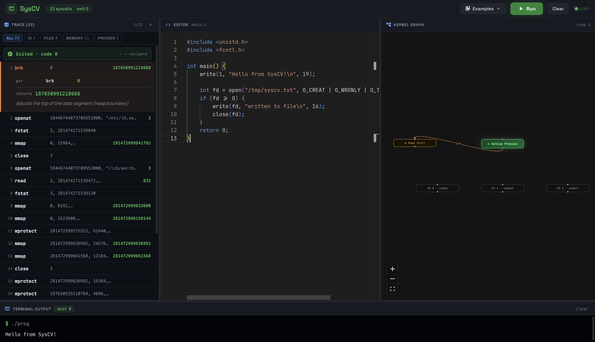

# SysCV — System Call Visualizer

> **Watch your C program talk to the kernel — one syscall at a time.**

SysCV is a local developer tool that lets you write C code in a browser editor, execute it inside a sandboxed Linux container, and step through every system call your program makes — with inspectable arguments, return values, and a live kernel interaction graph.



---

## What It Does

When you run a C program, the kernel is constantly receiving requests from it — to write to stdout, allocate memory, open files, fork processes. These are **system calls**, and they're normally invisible. SysCV makes them the main event.

1. **Write** any C program in the Monaco editor
2. **Run** it — the program executes inside Docker under `ptrace` control
3. **Inspect** every syscall captured: arguments, return values, plain-English descriptions
4. **Navigate** by step or filter by category (I/O, Memory, Files, Process)
5. **Watch** the Kernel Graph update as you click through steps — file descriptors appear when opened, heap nodes appear when `brk` fires, edges animate during reads and writes

---

## Architecture

```
┌─────────────────────┐         WebSocket          ┌──────────────────────────────┐
│   Browser (React)   │ ◄─────────────────────────► │  Go HTTP Server (:8080)      │
│                     │   JSON syscall events        │                              │
│  Monaco Editor      │                             │  runner.go                   │
│  Syscall Step List  │                             │    gcc -static -O0 main.c    │
│  Kernel Graph       │                             │    ptrace(PTRACE_SYSCALL)    │
│  (React Flow)       │                             │                              │
└─────────────────────┘                             │  tracer_amd64/arm64.go       │
                                                    │    reads registers           │
          Mac / Windows / Linux                     │    hydrates syscall args     │
               (any OS)                             │    streams events            │
                                                    └──────────────────────────────┘
                                                         Linux Docker container
                                                         (ptrace requires Linux)
```

**Key design decisions:**
- **Linux-in-Docker** — `ptrace` only works on Linux. Running the backend in a container means the tool works identically on macOS, Windows, and Linux with no host dependencies beyond Docker.
- **Collect then replay** — the program runs to completion before the UI enters "replay mode", so you can step backwards and forwards through the full syscall history.
- **Static compilation** (`-static -O0`) — reduces dynamic linker noise so the first syscall events you see come from your code, not glibc's startup.

---

## Stack

| Layer | Technology |
|-------|-----------|
| Frontend | React 18, Vite, Tailwind CSS v4 |
| Editor | Monaco Editor (`@monaco-editor/react`) |
| Graph | React Flow (`@xyflow/react`) |
| Backend | Go 1.22 |
| Tracing | Linux `ptrace` via `syscall` package |
| Transport | WebSocket (`gorilla/websocket`) |
| Sandbox | Docker + `SYS_PTRACE` capability |

---

## Prerequisites

- [Docker Desktop](https://www.docker.com/products/docker-desktop/) (Mac/Windows) or Docker Engine (Linux)
- [Node.js](https://nodejs.org/) 18+
- npm

No Go installation required — the backend builds and runs inside Docker.

---

## Quick Start

### 1. Start the backend

```bash
docker compose up --build
```

This builds the Go backend inside a Linux container with `gcc`, `ptrace` access, and all required capabilities. On subsequent runs, `--build` can be omitted.

The backend exposes a WebSocket at `ws://localhost:8080/trace`.

### 2. Start the frontend

```bash
cd frontend
npm install
npm run dev
```

Open **http://localhost:5173** in your browser.

---

## Usage

### Running your first trace

1. The editor opens with a "File I/O" example. Click **Run** — the program compiles and executes, and the right panel fills with numbered syscall steps.
2. Click any step to expand it and see the full argument list with types and values.
3. Use **← →** arrow keys (or the nav buttons) to step through calls one at a time.
4. Watch the **Kernel Graph** update — it shows the state of your process's file descriptors and memory at the selected step.

### Example programs

Click **Examples** in the header to load pre-written programs demonstrating:

| Example | What it shows |
|---------|---------------|
| File I/O | `write()` to stdout + `open`/`write`/`close` a file |
| Hello World | Simplest possible trace |
| Fork | `fork()` → child/parent split |
| Heap Alloc | `malloc`/`free` backed by `brk` and `mmap` |
| Process Info | `getpid`, `getppid`, `getuid` |

### Filtering by category

After running, use the category tabs to filter the step list:

- **All** — every syscall
- **I/O** — `read`, `write`, `pread64`, `writev`, …
- **Files** — `open`, `openat`, `close`, `stat`, `unlink`, …
- **Memory** — `mmap`, `munmap`, `brk`, `mprotect`, …
- **Process** — `fork`, `execve`, `exit`, `kill`, `getpid`, …
- **Other** — anything not in the above groups

### Writing your own code

Paste any C program into the editor. A few tips:

```c
// ✅ GOOD — write() is a direct syscall, always visible
write(1, "hello\n", 6);

// ⚠️  NEEDS fflush — printf buffers output in userspace
printf("hello\n");           // visible only with \n on a tty
printf("hello");             // may NOT produce a write() at all
fflush(stdout);              // forces a write() immediately
```

> **Why?** `printf` uses C's buffered I/O (`FILE*`). Inside Docker, stdout is not a terminal, so glibc uses *full buffering* instead of line buffering. Your bytes sit in a 4KB in-memory buffer until it fills up or you explicitly flush it.

---

## Project Structure

```
SysCV/
├── backend/
│   ├── Dockerfile                   # golang:1.22-bullseye + gcc
│   ├── cmd/server/main.go           # WebSocket server, session management
│   └── internal/
│       ├── runner/runner.go         # gcc compile + ptrace-launch
│       ├── syscalls/
│       │   ├── types.go             # SyscallDef, ArgDef, TypeXxx
│       │   ├── table_amd64.go       # 50+ syscall definitions (x86-64)
│       │   └── table_arm64.go       # 50+ syscall definitions (ARM64)
│       └── tracer/
│           ├── tracer_amd64.go      # ptrace loop, register reads (x86-64)
│           ├── tracer_arm64.go      # ptrace loop, register reads (ARM64)
│           ├── peeker.go            # PtracePeekData → string argument reader
│           └── types.go             # SyscallEvent, HydratedArg, ProcessExitEvent
├── frontend/
│   └── src/
│       ├── App.tsx                  # Main UI: editor, step list, replay logic
│       ├── components/
│       │   └── SyscallCanvas.tsx    # React Flow kernel graph
│       └── index.css                # Tailwind + scrollbar + React Flow overrides
└── docker-compose.yml               # Mounts backend src, adds SYS_PTRACE cap
```

---

## How the Tracer Works

```
1. runner.Compile()     gcc -static -O0 prog.c -o prog
2. runner.StartTrace()  exec with SysProcAttr{Ptrace: true}
3. TraceLoop()
   ├── Wait for SIGTRAP (child stopped at first instruction)
   ├── PtraceSetOptions(PTRACE_O_TRACESYSGOOD)
   └── loop:
       ├── PtraceSyscall(pid, 0)        ← let child run until next syscall
       ├── Wait4(pid)
       ├── if StopSignal == SIGTRAP|0x80:
       │   ├── PtraceGetRegs → Orig_rax (syscall number)
       │   ├── syscalls.GetDef(num) → name, description, arg types
       │   ├── if ENTER: read Rdi/Rsi/Rdx/R10/R8/R9 as args
       │   │            PtracePeekData → resolve string pointers
       │   └── if EXIT:  read Rax as return value
       └── stream event → WebSocket → frontend
```

The ARM64 path reads `X8` for the syscall number and `X0–X5` for arguments.

---

## Limitations

| Limitation | Reason |
|-----------|--------|
| C only | gcc is the only compiler in the container |
| glibc startup noise | Even `-static` binaries call `brk`/`uname`/`readlinkat` before `main()` |
| Single-process tracing | `fork()` creates a child that the tracer doesn't follow |
| No secure sandbox | Docker isolation, not gVisor/Firecracker — treat as a dev tool only |
| Local only | No auth, no multi-tenancy, not suitable for public deployment |

---

## License

MIT

---

*Built as an educational tool for understanding how programs interact with the Linux kernel.*
